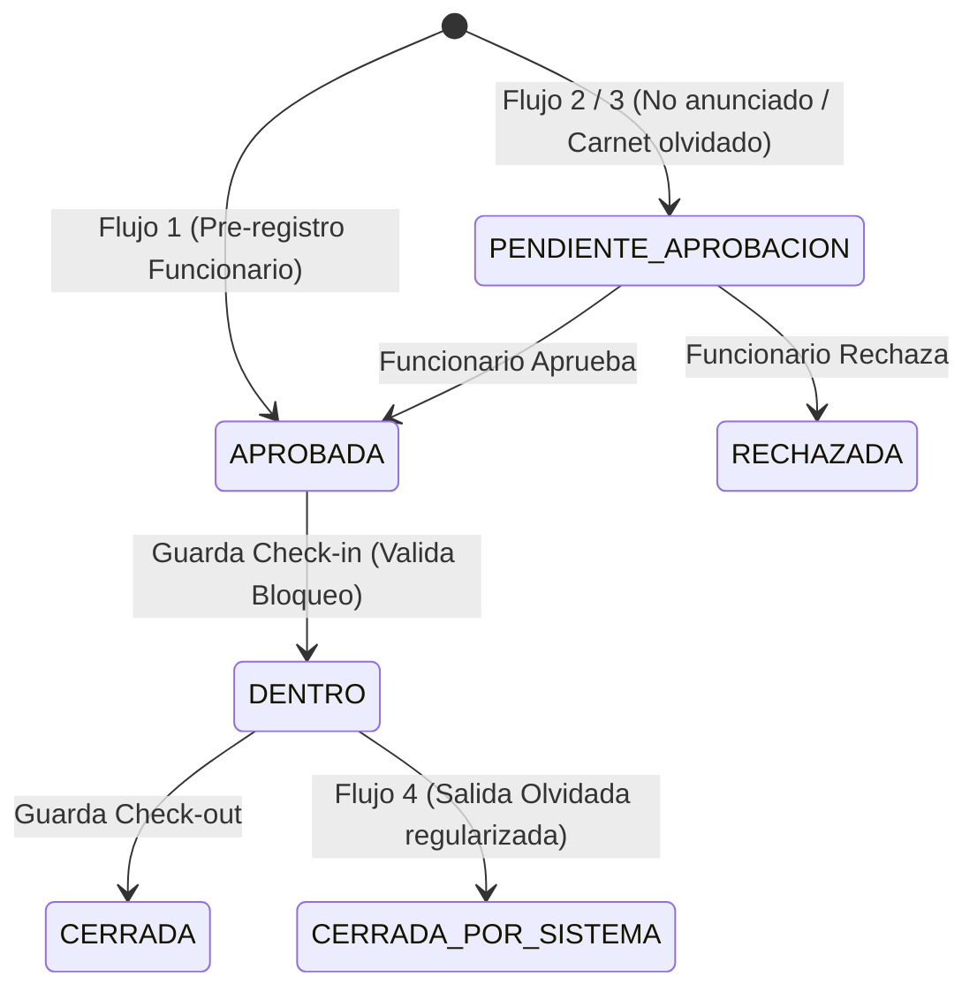
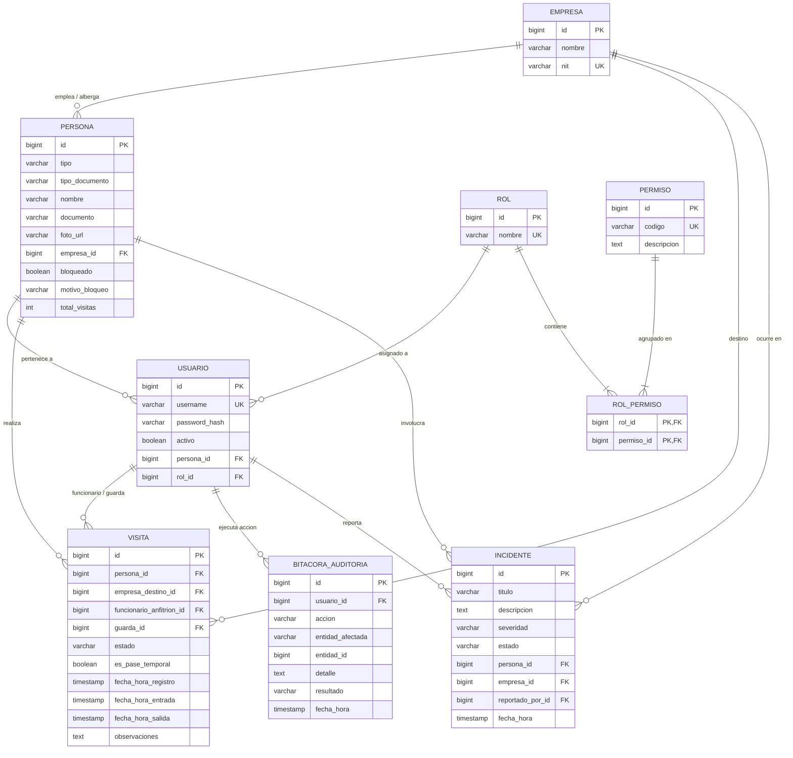

# SICA — Sistema Integrado de Control de Acceso para Zona Acme

Sistema empresarial de control de acceso físico, gestión de visitas, seguridad perimetral y trazabilidad para el complejo empresarial **"Zona Acme"** (que alberga más de 30 empresas de alto perfil), construido en **Java 17+** con **JavaFX**, **JPA/Hibernate 6.4**, **PostgreSQL** y **Arquitectura Hexagonal (Puertos y Adaptadores)** organizada en *Vertical Slices*.

---

## 📋 Contexto del Problema y Solución

El Complejo Empresarial **"Zona Acme"** contaba anteriormente con un sistema obsoleto basado en libros de papel y llamadas por radio:
- **Vulnerabilidad de seguridad**: Sin recuento confiable de personal dentro en caso de emergencias o evacuación.
- **Filas e ineficiencia**: Cuellos de botella con visitantes no anunciados esperando confirmación radial.
- **Falta de trazabilidad**: Auditoría manual, dispersa e ilegible.
- **Gestión reactiva de incidentes**: Incapacidad de aplicar restricciones de acceso inmediatas en todos los puntos de entrada.

**SICA** soluciona integralmente estos desafíos mediante:
1. **Control de Acceso Concurrente**: Gestión digital en tiempo real de entradas, salidas y pre-registros.
2. **Restricción Inmediata de Acceso**: Bloqueo instantáneo de personas no autorizadas en portería con alertas visuales.
3. **Módulo de Evacuación y Emergencias**: Recuento instantáneo del personal actualmente dentro (`DENTRO`) para protocolos de evacuación.
4. **Módulo de Incidentes de Seguridad**: Registro y gestión de incidentes perimetrales clasificados por severidad.
5. **Auditoría Inmutable al 100%**: Registro persistente en `bitacora_auditoria` de cada operación crítica (logins, check-in, check-out, bloqueos, modificaciones CRUD).
6. **Seguridad RBAC en Base de Datos**: Permisos granulares asignados dinámicamente a roles en la base de datos.

---

## 🏛️ Arquitectura Hexagonal y Vertical Slices

```
src/main/java/com/sicaproject/
├── Main.java                          # Smoke test de conexión a BD
├── SicaApplication.java               # Punto de entrada JavaFX (UI)
└── sica/
    ├── iam/                           # Identity & Access Management (Usuarios, Roles, Permisos, BCrypt, RBAC)
    ├── personas/                      # Gestión de Personas (Trabajadores e Invitados, Bloqueo de acceso)
    ├── empresas/                      # Gestión de Empresas Destino
    ├── acceso/                        # Visitas, Check-in, Check-out, Regularización automática
    ├── auditoria/                     # Bitácora persistente e inmutable de eventos
    ├── incidentes/                    # Reporte y gestión de incidentes de seguridad
    ├── shared/                        # CompositionRoot (DI manual) y JpaConfig (Hibernate)
    └── ui/                            # SceneManager, RefreshScheduler, Controladores JavaFX
```

---

## 🔄 Los 4 Flujos de Acceso de SICA



1. **Flujo 1 (Invitado Pre-registrado — El Flujo Ideal)**: El Funcionario registra previamente al invitado (`APROBADA`). Al llegar, el Guarda consulta el documento, visualiza su información, foto URL y anfitrión, y ejecuta el `check-in` (`DENTRO`). Al salir, se realiza el `check-out` (`CERRADA`).
2. **Flujo 2 (Invitado No Anunciado — En Tiempo Real)**: El visitante llega sin pre-registro. El Guarda genera una solicitud (`PENDIENTE_APROBACION`). El Funcionario anfitrión aprueba o rechaza desde su interfaz. El Guarda recibe la actualización en tiempo real y ejecuta el ingreso.
3. **Flujo 3 (Trabajador con Carnet Olvidado — Pase Temporal)**: Trabajador sin credencial física. El Guarda genera una solicitud con indicador de pase temporal (`paseTemporal = true`). El Funcionario aprueba un ingreso puntual para la jornada.
4. **Flujo 4 (Salida Olvidada — Regularización Automática)**: Si una persona intenta ingresar teniendo una visita anterior abierta en estado `DENTRO`, el sistema cierra automáticamente la visita anterior como `CERRADA_POR_SISTEMA`, registra en auditoría la acción `SALIDA_OLVIDADA`, y permite el nuevo ingreso sin bloquear al usuario.

---

## 🗄️ Modelo de Base de Datos (Diagrama Entidad-Relación)



---

## 💡 Decisiones de Diseño: Principios SOLID y Patrones

### Principios SOLID Aplicados:
- **Single Responsibility Principle (SRP)**: Cada módulo vertical (`iam`, `personas`, `empresas`, `acceso`, `auditoria`, `incidentes`) tiene una responsabilidad única y bien delimitada. Los controladores JavaFX únicamente gestionan la interacción de interfaz, delegando la lógica de negocio a los servicios de aplicación.
- **Open/Closed Principle (OCP)**: Los servicios y repositorios están abiertos a extensión (mediante interfaces y nuevas implementaciones de puertos) sin necesidad de modificar el código cliente. Las transiciones de estado de `EstadoVisita` y los niveles de `SeveridadIncidente` admiten nuevas reglas sin romper contratos existentes.
- **Liskov Substitution Principle (LSP)**: Todas las implementaciones de adaptadores JPA (`*RepositoryJpaAdapter`) satisfacen estrictamente los contratos de sus interfaces de puerto (`*Repository`), permitiendo sustitución transparente por implementaciones en memoria o mock para pruebas.
- **Interface Segregation Principle (ISP)**: Los puertos de salida están segregados por entidad (`VisitaRepository`, `IncidenteRepository`, `PersonaRepository`, `UsuarioRepository`, `RolRepository`, `EmpresaRepository`), evitando dependencias innecesarias.
- **Dependency Inversion Principle (DIP)**: Las capas de alto nivel (Servicios de Aplicación) dependen exclusivamente de abstracciones (Puertos `out`), nunca de clases concretas de infraestructura. El cableado de dependencias se gestiona de forma centralizada en [`CompositionRoot`](src/main/java/com/sicaproject/sica/shared/infrastructure/config/CompositionRoot.java).

### Patrones de Diseño Implementados:
1. **Repository Pattern (Puertos y Adaptadores)**: Aísla por completo el modelo de dominio de las operaciones de base de datos JPA / Hibernate.
2. **Composition Root / Service Locator**: Centraliza y organiza la instanciación e inyección de dependencias de todo el sistema sin frameworks externos invasivos.
3. **Observer Pattern**: Implementado en [`RefreshScheduler`](src/main/java/com/sicaproject/sica/ui/RefreshScheduler.java) con la interfaz `Refreshable`, notificando periódicamente a los controladores activos para actualizar la interfaz en tiempo real sin bloquear el hilo de JavaFX.
4. **State Pattern**: Modelado en [`EstadoVisita`](src/main/java/com/sicaproject/sica/acceso/domain/EstadoVisita.java) y gestionado en `Visita.cambiarEstado()` para garantizar que solo se ejecuten transiciones válidas del ciclo de vida del acceso.
5. **Mapper / Factory Pattern**: Clases dedicadas (`VisitaMapper`, `PersonaMapper`, `IncidenteMapper`, `UsuarioMapper`, `RolMapper`) para transformar de manera pura entre entidades persistentes y objetos de dominio.
6. **Strategy Pattern**: Validación de políticas de autorización granular y restricciones de bloqueo mediante [`RbacService`](src/main/java/com/sicaproject/sica/iam/application/service/RbacService.java).

### Lambdas y Stream API:
- Se utilizan intensivamente en los servicios y controladores para filtrado dinámico de visitas (activas, pendientes, aprobadas), recuento de evacuación, cálculo de estadísticas en tiempo real y mapeo de permisos.

---

## 🔐 Roles y Credenciales de Prueba

| Usuario | Contraseña | Rol | Permisos Principales |
|---|---|---|---|
| `admin1` | `123456` | **ADMIN** | Todos los permisos (Gestión usuarios, roles, empresas, personas, evacuación, incidentes, bitácora) |
| `guarda1` | `123456` | **GUARDA** | `registrar_visita`, `registrar_salida`, `reportar_incidente` (Check-in, Check-out, Solicitudes, Reporte de incidentes) |
| `funcionario1` | `123456` | **FUNCIONARIO** | `aprobar_visita`, `rechazar_visita`, `registrar_visita`, `bloquear_persona`, `reportar_incidente` (Pre-registro, Aprobaciones, Bloqueo de acceso) |

> 🔒 *Todas las contraseñas se almacenan con hashing BCrypt (cost factor 10).*

---

## 🚀 Requisitos e Instalación

### Requisitos:
- **Java**: OpenJDK 17 o superior
- **Maven**: 3.9+
- **PostgreSQL**: 15+ (base de datos `sica_db`)

### Configuración con Docker:
```bash
docker-compose up -d
```

### Inicialización manual de PostgreSQL:
```bash
psql -U postgres -h localhost -c "CREATE USER sica_user WITH PASSWORD 'sica_pass';"
psql -U postgres -h localhost -c "CREATE DATABASE sica_db OWNER sica_user;"
psql -U sica_user -h localhost -d sica_db -f schema.sql
psql -U sica_user -h localhost -d sica_db -f data.sql
```

---

## 💻 Compilación y Ejecución

### Ejecutar Pruebas Automatizadas:
```bash
mvn clean test
```

### Ejecutar Smoke Test de BD:
```bash
mvn exec:java -Dexec.mainClass="com.sicaproject.Main"
```

### Ejecutar la Aplicación JavaFX:
```bash
mvn javafx:run
```

---

## 🧪 Cobertura de Pruebas

- [`VisitaServiceFlowsTest`](src/test/java/com/sicaproject/sica/acceso/VisitaServiceFlowsTest.java): Pruebas de los 4 flujos de acceso, estados de visita y RBAC.
- [`BloqueoPersonaTest`](src/test/java/com/sicaproject/sica/personas/BloqueoPersonaTest.java): Verificación de denegación de check-in a personas bloqueadas y auditoría de motivos.
- [`AuthServiceAuditTest`](src/test/java/com/sicaproject/sica/iam/AuthServiceAuditTest.java): Validación de bitácora para inicios de sesión exitosos y fallidos.
- [`IncidenteServiceTest`](src/test/java/com/sicaproject/sica/incidentes/IncidenteServiceTest.java): Reporte, severidades, cambio de estado y auditoría de incidentes.
- [`EvacuacionEmergencyReportTest`](src/test/java/com/sicaproject/sica/acceso/EvacuacionEmergencyReportTest.java): Conteo y lista de personal dentro para evacuación en emergencias.
- [`LoginAndNavigationTest`](src/test/java/com/sicaproject/sica/iam/LoginAndNavigationTest.java): Autenticación, hashing BCrypt y navegación de paneles.
