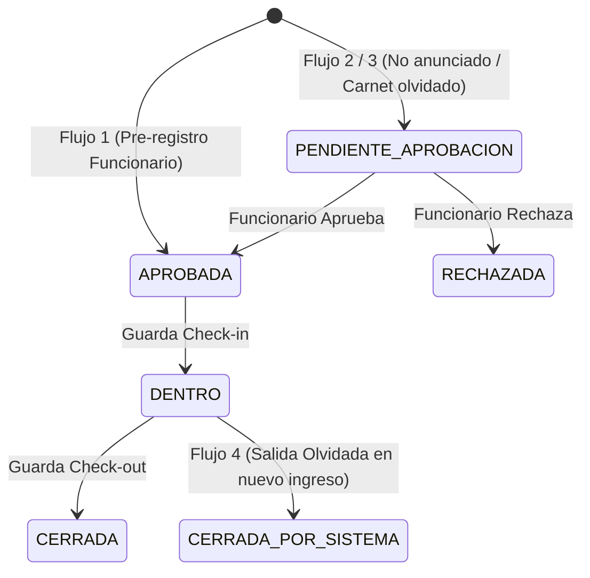

# SICA — Sistema Integrado de Control de Acceso

Sistema empresarial de control de acceso físico y gestión de visitas, construido en **Java 17+** con **JavaFX**, **JPA/Hibernate 6.4**, **PostgreSQL** y **Arquitectura Hexagonal (Puertos y Adaptadores)** organizada en *Vertical Slices*.

---

## 🏛️ Arquitectura

El sistema implementa una **Arquitectura Hexagonal** pura combinada con **Vertical Slices** por módulo de negocio:

```
src/main/java/com/sicaproject/
├── Main.java                          # Smoke test de conexión a BD
├── SicaApplication.java               # Punto de entrada JavaFX (UI)
└── sica/
    ├── iam/                           # Identity & Access Management (Usuarios, Roles, Permisos, BCrypt, RBAC)
    ├── personas/                      # Personas (Trabajadores e Invitados)
    ├── empresas/                      # Empresas destino
    ├── acceso/                        # Visitas, Check-in, Check-out, Máquina de estados
    ├── auditoria/                     # Bitácora persistente de eventos y seguridad
    ├── shared/                        # CompositionRoot (DI manual) y JpaConfig (Hibernate)
    └── ui/                            # SceneManager, Componentes (Partículas), Controladores JavaFX
```

---

## 🔄 Los 4 Flujos de Acceso de SICA



1. **Flujo 1 (Invitado Pre-registrado)**: El Funcionario registra la visita con anticipación (`APROBADA`). Al llegar, el Guarda realiza el `check-in` (`DENTRO`) y al salir registra el `check-out` (`CERRADA`).
2. **Flujo 2 (Invitado No Anunciado)**: El visitante llega a portería sin pre-registro. El Guarda crea una solicitud (`PENDIENTE_APROBACION`). El Funcionario anfitrión aprueba o rechaza desde su panel. Si es aprobada, el Guarda realiza el `check-in`.
3. **Flujo 3 (Carnet Olvidado / Pase Temporal)**: Trabajador de la empresa que no porta su credencial física. El Guarda solicita acceso con indicador de pase temporal (`paseTemporal = true`).
4. **Flujo 4 (Salida Olvidada / Regularización Automática)**: Si un visitante intenta ingresar teniendo una visita previa abierta (`DENTRO`), el sistema regulariza automáticamente la visita anterior pasándola a `CERRADA_POR_SISTEMA`, dejando constancia en la bitácora de auditoría (`SALIDA_OLVIDADA`), y permite el nuevo ingreso sin bloquear el flujo.

---

## 🔐 Roles y Credenciales de Prueba

| Usuario | Contraseña | Rol | Permisos Principales |
|---|---|---|---|
| `admin1` | `123456` | **ADMIN** | Todos los permisos (Gestión usuarios, roles, estadísticas, bitácora) |
| `guarda1` | `123456` | **GUARDA** | `registrar_visita`, `registrar_salida` (Check-in, Check-out, Solicitudes) |
| `funcionario1` | `123456` | **FUNCIONARIO** | `aprobar_visita`, `rechazar_visita` (Pre-registro, Aprobación de visitas) |

> 🔒 *Todas las contraseñas se almacenan hasheadas con BCrypt (cost factor 10).*

---

## 🚀 Requisitos e Instalación

### Requisitos:
- **Java**: OpenJDK 17 o superior (compatible con Java 21 / 26)
- **Maven**: 3.9+
- **PostgreSQL**: 15+ (configurado con base de datos `sica_db`)

### Configuración con Docker (Opcional):
```bash
docker-compose up -d
```

### Inicialización manual de PostgreSQL:
```bash
psql -U postgres -h localhost -c "CREATE USER sica_user WITH PASSWORD 'sica_pass';"
psql -U postgres -h localhost -c "CREATE DATABASE sica_db OWNER sica_user;"
psql -U sica_user -h localhost -d sica_db -f schema.sql
psql -U sica_user -h localhost -d sica_db -f data.sql
```

---

## 💻 Compilación y Ejecución

### Ejecutar Pruebas Unitarias e Integración:
```bash
mvn clean test
```

### Ejecutar la Aplicación Visual JavaFX:
```bash
mvn javafx:run
```

### Ejecutar Smoke Test de BD:
```bash
mvn exec:java -Dexec.mainClass="com.sicaproject.Main"
```

---

## 🧪 Cobertura de Pruebas

El proyecto incluye suites completas de pruebas automatizadas con JUnit 5:
- [`LoginAndNavigationTest`](src/test/java/com/sicaproject/sica/iam/LoginAndNavigationTest.java): Autenticación, hashing BCrypt, resolución de FXML por rol y carga de recursos.
- [`VisitaServiceFlowsTest`](src/test/java/com/sicaproject/sica/acceso/VisitaServiceFlowsTest.java): Validación exhaustiva de los 4 flujos de acceso, máquina de estados, auditoría persistente y denegación de permisos RBAC.
