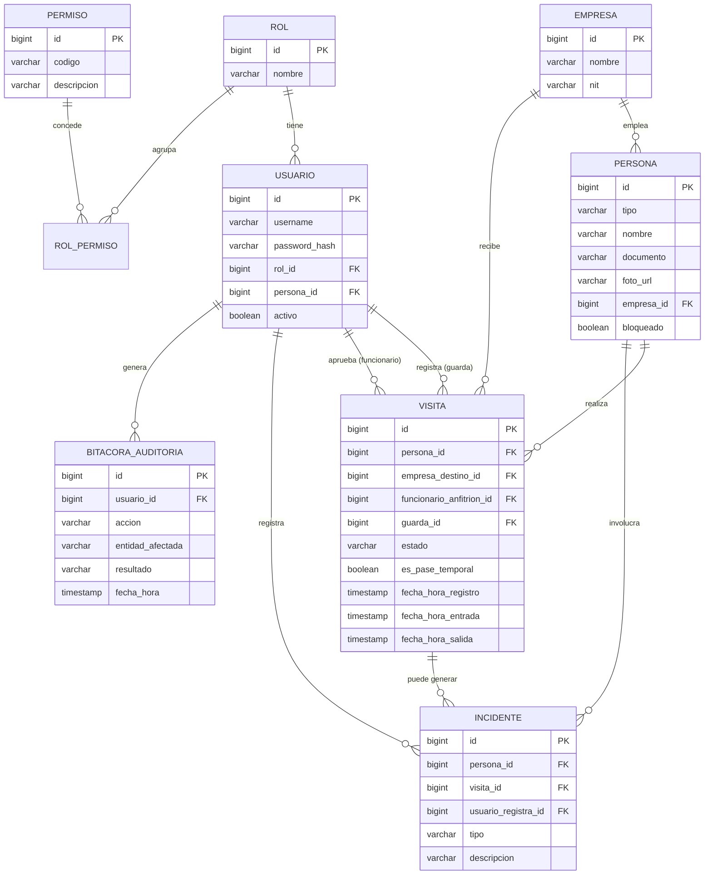

# SICA — Modelo de Dominio y Diagrama Entidad-Relación

## 1. Entidades principales

### USUARIO
Persona que inicia sesión en el sistema (Guarda, Funcionario, Admin).

| Campo | Tipo | Notas |
|---|---|---|
| id | BIGINT PK | |
| username | VARCHAR UNIQUE | |
| password_hash | VARCHAR | Nunca texto plano |
| rol_id | FK -> ROL | |
| persona_id | FK -> PERSONA, nullable | Si el usuario también es rastreado físicamente (ej. un funcionario que además entra al edificio) |
| activo | BOOLEAN | |

### ROL
| Campo | Tipo |
|---|---|
| id | BIGINT PK |
| nombre | VARCHAR (GUARDA, FUNCIONARIO, ADMIN) |

### PERMISO
| Campo | Tipo | Notas |
|---|---|---|
| id | BIGINT PK | |
| codigo | VARCHAR UNIQUE | ej: `registrar_visita`, `generar_reporte`, `bloquear_persona` |
| descripcion | VARCHAR | |

### ROL_PERMISO (tabla puente N:N)
| Campo | Tipo |
|---|---|
| rol_id | FK -> ROL |
| permiso_id | FK -> PERMISO |

### EMPRESA
| Campo | Tipo |
|---|---|
| id | BIGINT PK |
| nombre | VARCHAR |
| nit | VARCHAR UNIQUE |

### PERSONA
Trabajador o invitado — quien físicamente entra/sale del complejo.

| Campo | Tipo | Notas |
|---|---|---|
| id | BIGINT PK | |
| tipo | ENUM | TRABAJADOR / INVITADO |
| nombre | VARCHAR | |
| documento | VARCHAR UNIQUE | |
| foto_url | VARCHAR | |
| empresa_id | FK -> EMPRESA, nullable | Empresa empleadora (solo TRABAJADOR) |
| bloqueado | BOOLEAN | Restricción de acceso activa |
| motivo_bloqueo | VARCHAR, nullable | |

### VISITA
El corazón del sistema — un registro de entrada/salida.

| Campo | Tipo | Notas |
|---|---|---|
| id | BIGINT PK | |
| persona_id | FK -> PERSONA | |
| empresa_destino_id | FK -> EMPRESA | A quién visita |
| funcionario_anfitrion_id | FK -> USUARIO, nullable | Quien aprueba/es visitado |
| guarda_id | FK -> USUARIO | Quien hizo el check-in |
| estado | ENUM | Ver EstadoVisita abajo |
| es_pase_temporal | BOOLEAN | true = trabajador con carnet olvidado |
| fecha_hora_registro | TIMESTAMP | |
| fecha_hora_entrada | TIMESTAMP, nullable | |
| fecha_hora_salida | TIMESTAMP, nullable | |
| observaciones | VARCHAR, nullable | |

### INCIDENTE
| Campo | Tipo |
|---|---|
| id | BIGINT PK |
| persona_id | FK -> PERSONA, nullable |
| visita_id | FK -> VISITA, nullable |
| usuario_registra_id | FK -> USUARIO |
| tipo | VARCHAR |
| descripcion | VARCHAR |
| fecha_hora | TIMESTAMP |

### BITACORA_AUDITORIA
| Campo | Tipo | Notas |
|---|---|---|
| id | BIGINT PK | |
| usuario_id | FK -> USUARIO, nullable | Nullable: login fallido con usuario inexistente |
| accion | VARCHAR | ej: `LOGIN_EXITOSO`, `VISITA_APROBADA` |
| entidad_afectada | VARCHAR | ej: `VISITA` |
| entidad_id | BIGINT, nullable | |
| detalle | VARCHAR | |
| resultado | ENUM | EXITOSO / FALLIDO |
| fecha_hora | TIMESTAMP | |

---

## 2. Diagrama Entidad-Relación (Mermaid)



---

## 3. Máquina de estados de VISITA

```
                    ┌─────────────┐
   pre-registrado → │  APROBADA   │──────┐
                    └─────────────┘      │
                                          │ check-in
   no anunciado /  ┌──────────────────┐  │
   carnet olvidado→│ PENDIENTE_APROB. │  │
                    └────────┬─────────┘  │
                             │             ▼
               funcionario   │      ┌──────────┐   check-out   ┌─────────┐
               decide        ├─────►│  DENTRO  │──────────────►│ CERRADA │
                             │      └────┬─────┘                └─────────┘
                             ▼           │
                      ┌────────────┐     │ próximo ingreso sin
                      │ RECHAZADA  │     │ check-out previo
                      └────────────┘     ▼
                              ┌───────────────────────┐
                              │ CERRADA_POR_SISTEMA    │ (+ se crea nueva VISITA)
                              └───────────────────────┘
```

**Regla de negocio clave:** una transición inválida (ej. intentar check-out de una visita `RECHAZADA`) debe lanzar una excepción de dominio — esto es lo que valida `EstadoVisita` internamente, no la capa de infraestructura.

---

## 4. Esqueletos de clases de dominio (Java)

```java
// visitas/domain/EstadoVisita.java
package com.acme.sica.visitas.domain;

public enum EstadoVisita {
    APROBADA,
    PENDIENTE_APROBACION,
    DENTRO,
    RECHAZADA,
    CERRADA,
    CERRADA_POR_SISTEMA;

    public boolean puedeTransicionarA(EstadoVisita destino) {
        return switch (this) {
            case APROBADA -> destino == DENTRO;
            case PENDIENTE_APROBACION -> destino == APROBADA || destino == RECHAZADA;
            case DENTRO -> destino == CERRADA || destino == CERRADA_POR_SISTEMA;
            default -> false; // RECHAZADA, CERRADA, CERRADA_POR_SISTEMA son estados finales
        };
    }
}
```

```java
// visitas/domain/Visita.java
package com.acme.sica.visitas.domain;

import java.time.LocalDateTime;

public class Visita {
    private final Long id;
    private final Long personaId;
    private final Long empresaDestinoId;
    private Long funcionarioAnfitrionId;
    private final Long guardaId;
    private EstadoVisita estado;
    private final boolean pasetemporal;
    private final LocalDateTime fechaHoraRegistro;
    private LocalDateTime fechaHoraEntrada;
    private LocalDateTime fechaHoraSalida;

    // Constructor, getters omitidos por brevedad

    public void cambiarEstado(EstadoVisita nuevoEstado) {
        if (!this.estado.puedeTransicionarA(nuevoEstado)) {
            throw new TransicionEstadoInvalidaException(this.estado, nuevoEstado);
        }
        this.estado = nuevoEstado;
    }
}
```

```java
// visitas/application/port/out/NotificadorVisita.java
package com.acme.sica.visitas.application.port.out;

import com.acme.sica.visitas.domain.Visita;

// Puerto del patrón Observer — el dominio no sabe quién escucha ni cómo
public interface NotificadorVisita {
    void suscribir(ObservadorVisita observador);
    void notificarNuevaSolicitud(Visita visita);
    void notificarCambioEstado(Visita visita);
}
```

```java
// visitas/application/port/out/ObservadorVisita.java
package com.acme.sica.visitas.application.port.out;

import com.acme.sica.visitas.domain.Visita;

public interface ObservadorVisita {
    void onNuevaSolicitud(Visita visita);
    void onCambioEstado(Visita visita);
}
```

---

## 5. Próximos pasos sugeridos

1. Validar este modelo contra los 4 flujos del documento (pre-registrado, no anunciado, carnet olvidado, salida olvidada) — cada uno debe poder ejecutarse sin fricción con estas tablas.
2. Definir los permisos exactos por rol (tabla de siembra para `data.sql`).
3. Armar el esqueleto Maven con las dependencias (Spring Boot sin web, JavaFX, JPA, PostgreSQL, AtlantaFX).
